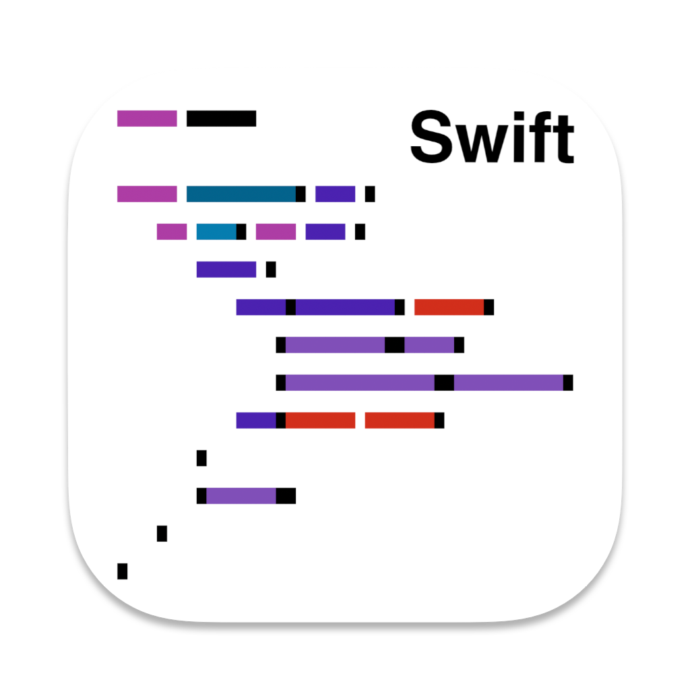

<picture>
  <source srcset="Sources/AppAssets/Assets.xcassets/AppIcon.imageset/AppIcon.png" media="(prefers-color-scheme: dark)">
  
</picture>

# Swift Formatter
Xcode extension for [swift-format](https://github.com/apple/swift-format).

For macOS Monterey (macOS 12) and later.

## How to install
Build from source (with Xcode 14) or download the [latest version](https://github.com/kuglee/Swift-format/releases/latest).
